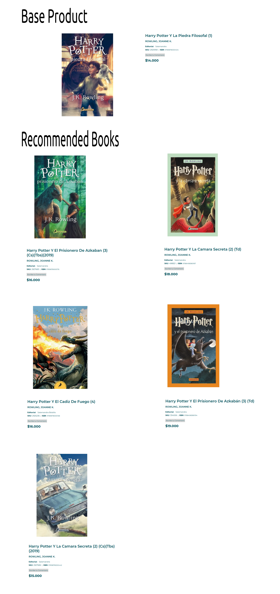
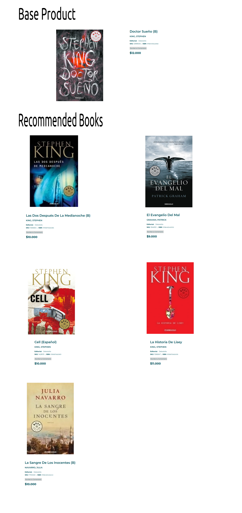
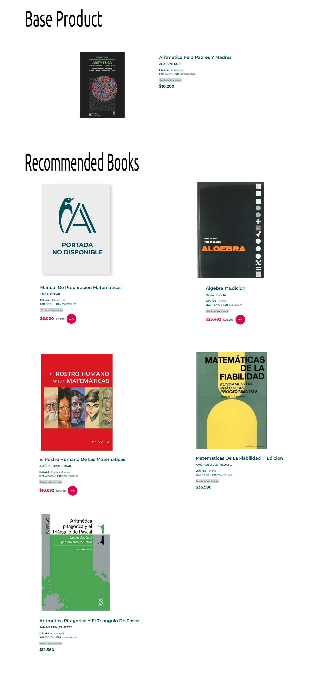

# Antartica Books Recommendation System

One of the secrets of many internet services (Youtube, Netflix, Tiktok) is their recommendation system. **They want you to spend as much time as possible on their pages**. For that, they have designed algorithms that, without even having finished watching a video, they are already recommending you another (the case of Youtube).

**This idea can be translated to internet shopping websites**. To prevent the consumer from leaving. And to keep them looking for all product the page can offer.

That is what we have done in this project, with pretty good results.

## Requirements

Run the Python Notebook `recommendation_system.ipynb` in an ipykernel with Python 3.9 environment.

The following libraries are required:

- [NumPy](http://www.numpy.org/)
- [Pandas](http://pandas.pydata.org/)
- [Scikit-Learn](http://scikit-learn.org/stable/)
- [SciPy](https://scipy.github.io/devdocs/index.html)
- [stop_words](https://pypi.org/project/stop-words/)

## Dataset

The data was scraped from the [Antartica](https://www.antartica.cl/) using 

- [Scrapy](https://scrapy.org/)

## Methodology

First we vectorized each of the following variables extracted from data:

- Book Author,
- Book Category,
- Book Editorial,
- Book Review,
- Book Discount.

to be presented as vectors.

Next we defined a function to measure similarities in `similarities.py` called *get_similarities*. Calculating the cosine of the angle formed by two vectors. As low angles means similar direction vectors. After we gathered this information into square matrices.

We summed the 5 matricces to pass them through the Recommendations class in `recommendations.py` to make the recommendations.

## Results

We obtained a working recommendation system: 5 recommendations are chosen taking into account the above variables. 

## Examples

Example 1:

 

Example 2:

 

Example 3:

 

## Support

Give a :star: if you like it :hugs:.